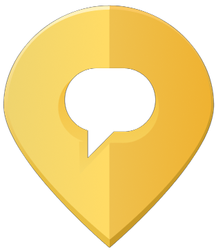

<p align="center">
  <a href="https://yourpeer.nyc"></a>
</p>

This repository contains the source code to [YourPeer.nyc](https://yourpeer.nyc)

YourPeer.nyc allows users to search through 2600+ free support services across NYC.

YourPeer.nyc is developed by [Streetlives](https://www.streetlives.nyc/), a US nonprofit based in New York City.

# Getting started

YourPeer.nyc is a [Next.js](https://nextjs.org/) app.

Create a `.env.local` in your project root directory. It should contain the following entries:

```
NEXT_PUBLIC_GO_GETTA_PROD_URL=https://w6pkliozjh.execute-api.us-east-1.amazonaws.com/Stage
NEXT_PUBLIC_GOOGLE_MAPS_API_KEY=<insert a google maps API key here or contact us to get a development key>

# Datadog APM (optional)
DD_TRACE_ENABLED=true
DD_SERVICE=yourpeer-nyc-nextjs
DD_ENV=development
DD_VERSION=0.1.0
```

To report traces to Datadog, run the Datadog Agent and provide `DD_AGENT_HOST` and/or
`DD_TRACE_AGENT_URL` based on your environment. See Datadog Node.js tracing docs for
agent connectivity options.

Then run:

```
# npm install
# npm run build
# npm run dev
```

# Contributing

Please open a pull request. Ensure that each source file includes the correct license header template, like this:

```
Copyright (c) 2024 Streetlives, Inc., [your name]

Use of this source code is governed by an MIT-style
license that can be found in the LICENSE file or at
https://opensource.org/licenses/MIT.
```
